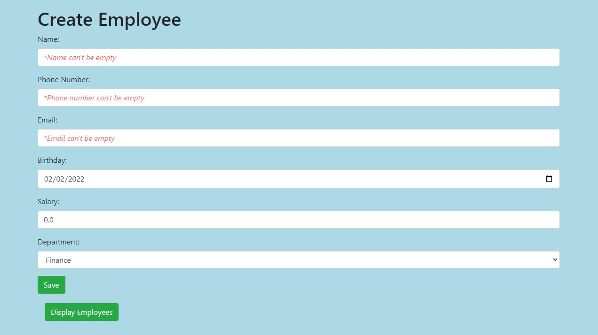

Spring MVC App
================

## Description

Application that represents a simple **"Departments Service"** system with two main entities - Employee and Department.
 
A department can have many employees and an employee can only belong to 1 department (@ManyToOne relationship).
 
 
Users have the ability to create, edit and delete entries.
 
Also they have the possibility to display all employees which belonging to specific department by clicking the button
 
with name of the last one.
 
 
This project is **a collection of tools** of development in the Java ecosystem. A strong focus of these is the Spring
Framework.

### Covering a number of tools such as:

- Maven build system
- Java Persistence API
- Oval validator
- BindingResult
- Generics<T, U>
- Global Exception Handler (response with a JSON representation)
- Docker
- MYSQL
- JSP views (use jstl)
- CSS
- Bootstrap
- Guava library

### Suitable links:

- [Spring Initializr](https://start.spring.io/)
- [Hibernate ORM](https://hibernate.org/)
- [Oval Validation Framework](https://sebthom.github.io/oval/USERGUIDE.html)
- [Docker](https://docs.docker.com/)
- [Global Exception Handler](https://www.baeldung.com/exception-handling-for-rest-with-spring)
   
   
  
   
   
- Display employees by Department
   
   
    
   
   
- Error warnings appear after clicking **Save** with empty fields
   
   
  
   
   
  
   
   
  
   
   
  
   
   
  